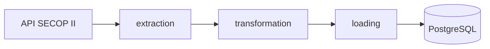

# SECOP II ETL Pipeline

Pipeline ETL que extrae todos los contratos públicos del SECOP II (datos.gov.co),
los transforma y los carga incrementalmente en PostgreSQL siguiendo un modelo 
dimensional (esquema estrella). El objetivo es construir un data warehouse limpio, 
documentado y listo para ser consumido por herramientas de análisis, BI y ciencia de datos.

Fuente de datos: [SECOP II — Contratos Electrónicos](https://www.datos.gov.co/resource/jbjy-vk9h)

---

## Cómo ejecutar en local
1. Clonar el repositorio
2. `pip install -r requirements.txt`
3. Configurar `.env` con credenciales basandose en el .env.example
4. `docker compose up -d`
5. `python main.py --mode initial o python main.py --mode incremental`

--mode initial: Para la primera vez que ejecutas el pipeline
--mode incremental: Para actualizar la base de datos 

## Arquitectura

## Modelo de datos

## Tecnologías
Python · Pandas · PostgreSQL · SQLAlchemy · Power BI · Docker · Git

## Recursos

- Documentación técnica: [`docs/`](docs/)
- Dashboards y diagramas: [`assets/`](assets/)