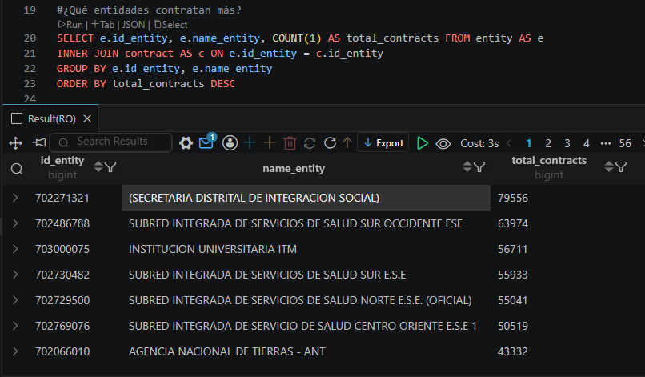
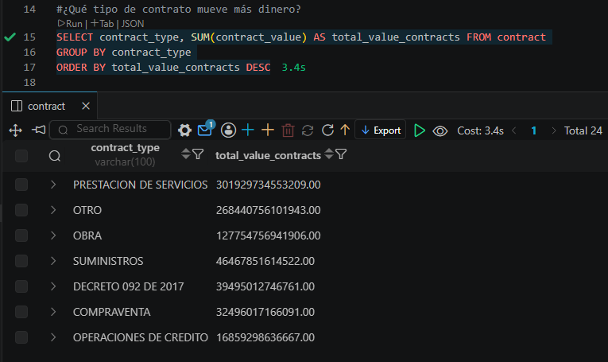

# SECOP II ETL Pipeline

<p align="center">


</p>

ETL pipeline that incrementally extracts Colombian public procurement contracts from **SECOP II**, transforms the data into a dimensional model, and loads it into a PostgreSQL data warehouse designed for analytical workloads.

---

## Overview

SECOP II is Colombia's official public procurement platform and publishes millions of contract records through the Socrata Open Data API.

This project automates the complete ETL process by:

- Extracting contract data incrementally from the SECOP II API.
- Cleaning and validating raw records.
- Transforming the data into a Star Schema.
- Loading the processed data into PostgreSQL.
- Running automatically through GitHub Actions.

---

## Queries Examples





---

## Features

- Incremental extraction strategy
- Modular ETL architecture
- Star Schema data model
- PostgreSQL data warehouse
- Dockerized deployment
- Automated GitHub Actions workflow
- Logging
- Data quality validation

---

## Getting Started

Clone the repository:

```bash
git clone https://github.com/bryanmg20/secop2-etl-pipeline.git
```

Install dependencies:

```bash
pip install -r requirements.txt
```

Create a `.env` file from the provided template:

```bash
cp .env.example .env
```

Update the environment variables with your own configuration.

Start PostgreSQL:

```bash
docker compose up -d
```

### Initial Load

Run the pipeline in **initial mode** to populate an empty database with all available records.

```bash
python main.py --mode initial
```

### Incremental Load

After the initial load, run the pipeline in **incremental mode** to ingest only newly published records.

```bash
python main.py --mode incremental
```

### Running the API

```bash
uvicorn api.main:app --reload
```

---

## Documentation

- [Architecture](docs/architecture.md)
- [Data Dictionary](docs/data_dictionary.md)

## API Documentation

The API is available through FastAPI and can be explored interactively at:

- `/docs` for Swagger UI
- `/redoc` for ReDoc

Key capabilities:

- List contracts with pagination and filtering
- Search contracts, entities and providers
- Retrieve aggregate statistics and rankings

Example usage:

```bash
curl http://localhost:8000/contracts/?limit=10&offset=0
curl http://localhost:8000/contracts/filter?contract_type=Service%20provision&year=2024
curl http://localhost:8000/health
```