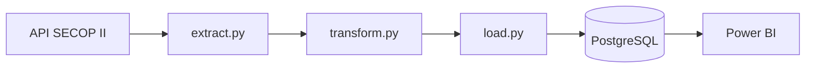

# secop2-etl-pipeline

Pipeline ETL que extrae contratos públicos de SECOP II (datos.gov.co),
los transforma y carga en PostgreSQL siguiendo un esquema estrella,
con visualización en Power BI.

---

## Cómo ejecutar
1. Clonar el repositorio
2. `pip install -r requirements.txt`
3. Configurar `.env` con credenciales basandose en el .env.example
4. `docker compose up -d`
5. `python main.py`

## Arquitectura

## Modelo de datos

## Tecnologías
Python · Pandas · PostgreSQL · SQLAlchemy · Power BI · Docker · Git

## Recursos

- Documentación técnica: [`docs/`](docs/)
- Dashboards y diagramas: [`assets/`](assets/)

