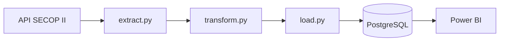

# SECOP II ETL Pipeline

Pipeline ETL que extrae los datos públicos de contratación del SECOP II, los transforma y los carga en PostgreSQL siguiendo un modelo dimensional (esquema estrella), proporcionando una base de datos optimizada para análisis y consultas.

### Visión del proyecto

Construir una plataforma de datos reutilizable sobre el SECOP II que permita a personas investigadoras, analistas, periodistas, entidades públicas y desarrolladores acceder a información de contratación pública mediante un Data Warehouse mantenido y documentado, listo para ser consumido desde herramientas de análisis, aplicaciones y APIs.
---

## Cómo ejecutar
1. Clonar el repositorio
2. `pip install -r requirements.txt`
3. Configurar `.env` con credenciales basandose en el .env.example
4. `docker compose up -d`
5. `python main.py`

## Arquitectura

## Modelo de datos

## Tecnologías
Python · Pandas · PostgreSQL · SQLAlchemy · Power BI · Docker · Git

## Recursos

- Documentación técnica: [`docs/`](docs/)
- Dashboards y diagramas: [`assets/`](assets/)

