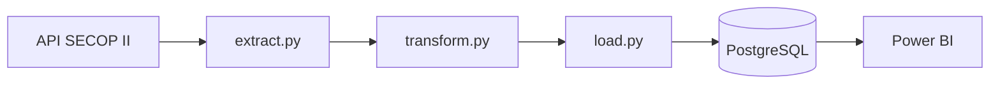
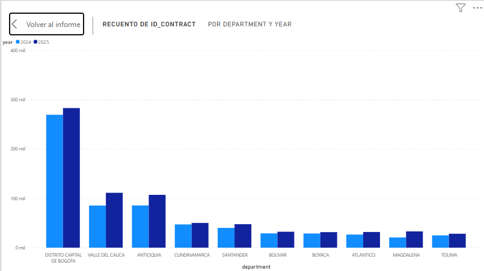
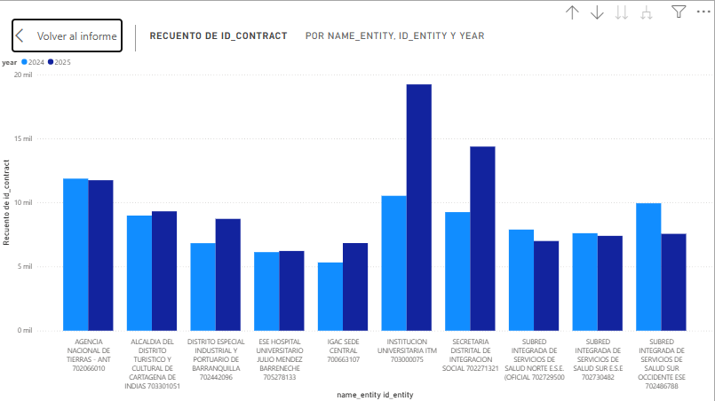
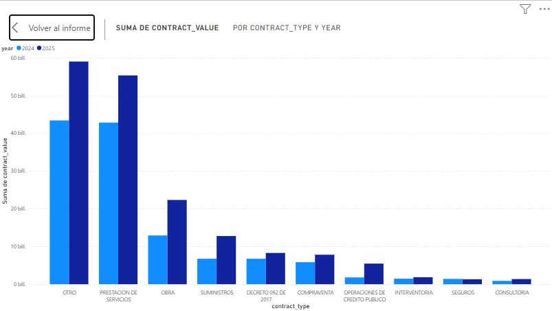
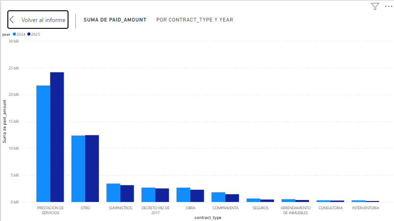

# secop2-etl-pipeline

Pipeline ETL que extrae contratos públicos de SECOP II (datos.gov.co),
los transforma y carga en PostgreSQL siguiendo un esquema estrella,
con visualización en Power BI.

---

## Arquitectura

## Modelo de datos

## Dashboard

TOP 10 departamentos con mayor numero de contratos firmados entre el 2024 y 2025

TOP 10 entidades con mayor numero de contratos firmados entre el 2024 y 2025

TOP 10 tipos de contratos con mayores valores de contratos firmados entre el 2024 y 2025

TOP 10 tipos de contratos con mayores valores pagados hasta la fecha 05/07/26

# Calidad de datos

Porcentaje de valores nulos por columna:

Total de filas traidas de la api: 1898936

**Columnas con nulos relevantes:**
- `fecha_inicio_liquidacion`: 87.5% — mayoría de contratos no liquidados
- `fecha_fin_liquidacion`: 87.5% — misma razón
- `fecha_de_inicio_del_contrato`: 0.75% — casos aislados

Hallazgos de calidad de datos: 

Se encontraron contratos duplicados en la fuente (mismo id_contract con 
valores idénticos). Se eliminó el duplicado conservando una sola instancia.

Se encontró fecha de fin del contrato en el año 5025, se dejaron tan cual, aunque con fechas incompatibles con pandas se pasaron a NaT. Supongo que se equivocaron escribiendo o es un contrato indefinido. Es de esperarse encontrarse mas fechas de este estilo.

Hallazgos de fechas de los contratos:
Fecha de inicio del contrato antes que fecha de firma del contrato: 385
Fecha de fin del contrato antes que fecha de inicio del contrato: 533

Es necesario tener en cuenta estas inconcistencias a la hora de hacer calculos con fechas.

## Tecnologías
Python · Pandas · PostgreSQL · SQLAlchemy · Power BI · Docker · Git

## Cómo ejecutar
1. Clonar el repositorio
2. `pip install -r requirements.txt`
3. Configurar `.env` con credenciales
4. `docker compose up -d`
5. `python main.py`